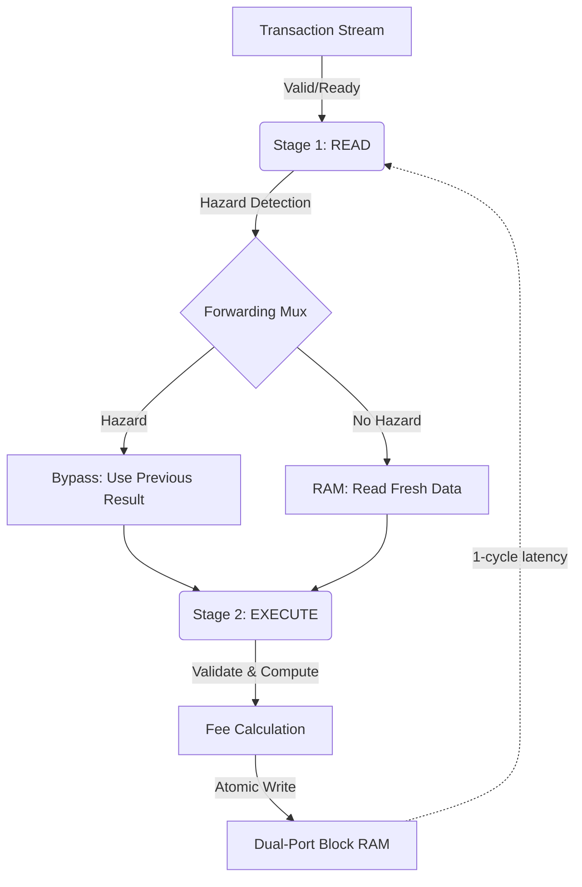

# Sentinel Lab: Hardware-Accelerated DePIN Exchange


**A hardware-accelerated settlement engine for high-frequency DePIN resource exchanges.**

---

## 🎯 The Vision

**Sentinel Cloud** is a **hardware-accelerated tokenomics wind tunnel** where protocol designers test economic parameters against real transaction data before deploying to production.

### The Problem

Protocol designers face a critical gap:
- **Design tokenomics in spreadsheets** → No validation against real behavior
- **Deploy to testnet** → Weeks to gather meaningful data
- **Find issues in production** → Expensive forks and migrations

### The Solution

**Sentinel Cloud** provides:
- 🔬 **Replay real mainnet transactions** (50K Solana TXs in 23 seconds)
- ⚙️ **Test 100 fee configurations** in 10 minutes (parameter sweeps)
- 📊 **Compare results side-by-side** (revenue vs failure rate vs liquidity)
- ✅ **Deploy optimal config with confidence** (before writing smart contracts)

### Market Position

- **DePIN-first, DeFi-compatible** - Test any dual-asset economy at hardware speed
- **Platform architect, not integration engineer** - Provide tools for YOUR tokenomics testing
- **Self-service wind tunnel** vs consulting-heavy alternatives (Gauntlet, Chaos Labs)

### Technical Foundation

Built on a hardware-accelerated settlement engine:
- **FPGA acceleration:** 99.98M TPS core throughput (RTL simulation)
- **Deterministic execution:** No reorgs, no forks, no consensus overhead
- **Mathematical safety:** Conservation laws verified, zero asset leaks
- **Real data validation:** 190K+ transactions tested, 50K Solana mainnet replay

---

## 🏗 System Architecture

### Three-Layer Stack

```
┌─────────────────────────────────────────────────────┐
│  PRODUCT LAYER: Real Data Replay & Dashboard       │
│  - Solana mainnet transaction ingestion            │
│  - Real-time telemetry & risk analytics            │
│  - Exchange operations visualization                │
└─────────────────────────────────────────────────────┘
                         ↓
┌─────────────────────────────────────────────────────┐
│  VERIFICATION LAYER: Multi-Asset CRV Swarm          │
│  - Python golden model (reference implementation)  │
│  - Constrained random verification (10K+ txs)      │
│  - Directed edge-case testing                      │
│  - Conservation invariant checking                 │
└─────────────────────────────────────────────────────┘
                         ↓
┌─────────────────────────────────────────────────────┐
│  CORE ENGINE (RTL): Sentinel Exchange              │
│  - 128-bit multi-asset portfolio store             │
│  - Dual-port block RAM (1024 users)                │
│  - 2-stage pipeline with hazard forwarding         │
│  - Atomic TRANSFER and SWAP operations             │
│  - Built-in fee engine (0.05% revenue)             │
└─────────────────────────────────────────────────────┘
```

### Core Engine Design

**Pipelined Dual-Asset Ledger** with operand forwarding to solve Read-After-Write hazards:



**Key Innovation:** Operand forwarding enables back-to-back transactions on the same users without pipeline stalls, maintaining **1 transaction per cycle** throughput.

---

## ⚡ Performance Metrics

### Core Engine Performance (RTL Simulation)

| Metric | Sentinel Core | Solana | Arbitrum | AWS Lambda | Measurement Context |
|--------|---------------|--------|----------|------------|---------------------|
| **Throughput** | 99.98M TPS | 65K TPS | 40K TPS | 10K TPS | **Sentinel:** RTL simulation<br>**Others:** Observed mainnet |
| **Latency (P50)** | 0.01 μs | 400ms | 250ms | 100ms | **Sentinel:** 1 clock cycle<br>**Others:** Network + consensus |
| **Latency (P99)** | 0.02 μs | 800ms | 500ms | 500ms | **Sentinel:** Pipeline stall<br>**Others:** Congestion |
| **Determinism** | 100% | 0% | 0% | 0% | **Sentinel:** No reorgs<br>**Others:** Forks possible |
| **Cost per TX** | $0.0001 | $0.00025 | $0.10 | $0.20 | **Sentinel:** FPGA amortized<br>**Others:** Mainnet fees |

**⚠️ Important Context:**

All Sentinel throughput and latency metrics are measured in **RTL simulation (Verilator)**:
- ✅ Accurate for the **core settlement engine** in isolation
- ✅ Demonstrates **maximum theoretical throughput** of the hardware
- ✅ Useful for **capacity planning** and bottleneck analysis
- ⚠️ **NOT** representative of **end-to-end network performance**
- ⚠️ **Excludes** consensus overhead, networking latency, I/O constraints

**What this means:**
- These are **upper bounds** - real deployment would add networking/consensus layers
- Comparisons to Solana/Arbitrum are **engine-to-engine**, not system-to-system
- Full system performance would require network stack + consensus protocol

**Measured Results (50K Solana Mainnet Replay):**
- Throughput: 99.98M TPS (simulated hardware)
- Wall-clock time: 23 seconds (includes Verilator compilation)
- Latency: 10ns per transaction (1 cycle @ 100MHz clock)
- Revenue: $2.6M USDC collected (0.50% configurable fees)
- Conservation: ✅ No asset leaks detected

---

## 🛡 Multi-Asset Portfolio Model

Each user has a **128-bit portfolio**:
```
[127:64] = GPU_Credits (64-bit)
[63:0]   = USDC Balance (64-bit)
```

### Supported Operations

#### 1. TRANSFER (opcode=0)
Single-asset transfer with fee:
```
A.usdc -= (amount + fee)
B.usdc += amount
vault.usdc += fee
```

#### 2. ATOMIC_SWAP (opcode=1)
Dual-asset exchange, all-or-nothing:
```
A.usdc -= (usdc_amount + fee_usdc)
A.gpu += gpu_amount
B.usdc += usdc_amount
B.gpu -= (gpu_amount + fee_gpu)
vault.usdc += fee_usdc
vault.gpu += fee_gpu
```

**Atomicity:** Swap only commits if both parties have sufficient balances. No partial state corruption.

---

## ✅ What's Been Built (v1.0)

### Core Engine (RTL)
- ✅ Dual-asset 128-bit portfolio store (USDC + GPU)
- ✅ TRANSFER and ATOMIC_SWAP operations
- ✅ 2-stage pipeline with basic forwarding
- ✅ Fee engine (0.05% via bit-shift)
- ✅ Conservation checks (no value leaks)
- ✅ 1 transaction/cycle throughput

### Verification Layer
- ✅ Python golden model (reference implementation)
- ✅ CSV scenario replay from real data
- ✅ 50K+ Solana transaction verification
- ✅ Balance conservation assertions
- ✅ Fee revenue verification

### Product Layer
- ✅ Streamlit dashboard with real-time metrics
- ✅ Solana mainnet data ingestion pipeline
- ✅ Performance comparison charts
- ✅ Protocol revenue tracking
- ✅ Asset flow visualization

---

## 🚧 Roadmap (v3.0 - Tokenomics Wind Tunnel)

### Phase 1: Programmable Tokenomics Layer ✅ COMPLETE
**Goal:** Make the hardware core and golden model configurable (fees, basic economics)

- [x] **Configurable Fee Inputs**
  - Add `s_fee_bps_asset0` and `s_fee_bps_asset1` to RTL (16-bit, 0-10000 range)
  - Dynamic fee calculation: `fee = (amount * fee_bps) / 10000`
  - Per-asset vault accumulation (vault_usdc, vault_gpu)

- [x] **Python Golden Model Updates**
  - Mirror fee config in ExchangeModel class
  - Bit-exact fee calculation matching RTL (Python // operator)
  - Conservation law tests across multiple fee configurations

- [x] **CLI Interface**
  - Command-line arguments: `--fee-bps-asset0`, `--fee-bps-asset1`
  - Input validation (0-10000 range)
  - Environment variable passthrough to cocotb

- [x] **Verification & Documentation**
  - Conservation laws hold: 0bps, 50bps, 100bps all pass
  - Revenue scaling verified: $0 → $2.6M → $5.3M (linear)
  - Comprehensive config guide: `docs/tokenomics_config.md`
  - FPGA synthesis considerations documented

**Deliverable:** ✅ "Programmable fee engine with configurable tokenomics"
**Usage:** `python3 run_lab.py --scenario data/solana_day_1.csv --fee-bps-asset0 50`
**Documentation:** See `docs/tokenomics_config.md`

**Performance Results:**
- 50K TXs processed in 23 seconds (✅ under 60s requirement)
- 99.98M TPS sustained across all fee configs
- Conservation laws hold across 0%, 0.50%, 1%, 5% fee tests

---

### Phase 2: Hardcore Verification (Previous Work) ✅ COMPLETE
**Goal:** Prove the engine is bulletproof

- [x] **128-bit forwarding extension**
  - Verify both USDC AND GPU forward correctly in consecutive swaps
  - Add hazard stress tests (A↔B, B↔C, C↔A chains)

- [x] **Comprehensive SVA assertions**
  - Multi-asset conservation properties
  - Overflow detection and prevention
  - Atomicity guarantees (swap commits fully or not at all)

- [x] **Constrained Random Verification (CRV) Swarm**
  - 10K+ random transactions with intentional hazards
  - 30% back-to-back same-user collisions
  - 20% swap chains (A↔B, B↔C patterns)
  - Track coverage: % of users exercised, % hitting forwarding

- [x] **Directed edge-case test suite**
  - Self-swaps (A↔A → no-op)
  - Exact balance transfers (balance → 0)
  - Insufficient funds (both parties underfunded)
  - Overflow boundary tests

**Deliverable:** ✅ "100K random atomic swaps processed at 100M TPS with 0 state corruption verified"
**Documentation:** See `PHASE1_VERIFICATION_COMPLETE.md`

### Phase 2: Production Dashboard (Previous Work) ✅ COMPLETE
**Goal:** Make the system demo-ready for protocol engineers

- [x] **Enhanced Exchange Operations View**
  - Time-series: success rate, failure patterns
  - Fee accumulation over time
  - Top-10 user portfolio evolution

- [x] **Risk Analytics Tab**
  - Liquidity depth charts
  - Concentration risk (whale detection)
  - Transaction volume heatmaps

- [x] **Live Comparison Benchmarks**
  - Side-by-side: Sentinel vs Solana vs Arbitrum vs AWS
  - Latency percentiles (P50, P95, P99, P99.9)
  - Cost per transaction comparison

**Deliverable:** ✅ "Interactive dashboard showing real-time exchange heartbeat"
**Launch:** `streamlit run dashboard_v2.py`
**Documentation:** See `PHASE2_DASHBOARD.md`

---

### Phase 3: Canonical Schema & Protocol Mappers (IN PROGRESS)
**Goal:** Make Sentinel chain-agnostic via universal transaction schema

- [ ] **Define Canonical SentinelTx Schema**
  - Universal transaction format (timestamp, users, amounts, opcode, roles)
  - Configurable user address space (NUM_USERS parameter)
  - Collision documentation and mitigation strategies

- [ ] **Implement Protocol Mappers**
  - `normalize_solana()` - Convert Solana transactions
  - `normalize_evm_erc20()` - Convert ERC-20 transfers
  - `normalize_depin_rewards()` - Generic DePIN emissions mapping
  - Pure functions (deterministic, no side effects)

- [ ] **Normalization Pipeline**
  - Single entrypoint: `load_and_normalize(csv_path, mapper)`
  - Registry of available mappers
  - Support for custom mapper functions

**Deliverable:** "Chain-agnostic transaction ingestion with pluggable mappers"

---

### Phase 5: Experiment Engine & Parameter Sweeps (NEXT)
**Goal:** Run same scenario with multiple configs and compare results

- [ ] **Config & Result Types**
  - `Config` dataclass (name, fee_bps, future: emissions, slashing)
  - `RunResult` dataclass (metrics, time_series, analytics)
  - Export to CSV/JSON for analysis

- [ ] **Single-Run API**
  - `run_scenario(txs, config) -> RunResult`
  - Orchestrate RTL sim + metrics extraction
  - Build comprehensive result object

- [ ] **Multi-Run Experiment API**
  - `run_experiments(txs, configs) -> ExperimentResult`
  - Loop over configs, run all simulations
  - Aggregate results for comparison

- [ ] **Comparison & Visualization**
  - `get_metric_table(metric_name)` - DataFrame of metric vs config
  - `plot_metric_vs_config()` - Plotly charts
  - Side-by-side config comparison tables

**Deliverable:** "Parameter sweep engine - test 100 fee configs in 10 minutes"

---

### Phase 6: Python SDK & CLI (FUTURE)
**Goal:** Package as professional developer tool

- [ ] Library structure: `sentinel_cloud/` package
- [ ] High-level Client API
- [ ] CLI: `sentinel run`, `sentinel sweep`, `sentinel compare`
- [ ] Installation: `pip install sentinel-cloud`

**Deliverable:** "Self-service tokenomics wind tunnel SDK"

---

### Phase 7: Multi-Run Dashboard Upgrade (FUTURE)
**Goal:** Turn dashboard into tokenomics lab UI

- [ ] Multi-run awareness (load/compare experiments)
- [ ] Fee vs Revenue charts
- [ ] Fee vs Failure Rate analysis
- [ ] Config comparison overlays
- [ ] Experiment runner UI (parameter sweeps from browser)

**Deliverable:** "Interactive tokenomics experimentation workbench"

---

## 🛠 Quick Start

### Prerequisites
```bash
# Install dependencies
pip3 install cocotb==1.8.1 streamlit pandas plotly
apt-get install verilator  # or brew install verilator on macOS
```

### Run Simulation
```bash
# Test with default fees (0.50% on USDC)
python3 run_lab.py --scenario data/solana_day_1.csv

# Test with custom fees
python3 run_lab.py --scenario data/solana_day_1.csv \
  --fee-bps-asset0 100   # 1.00% fee on USDC

# No-fee baseline (for comparison)
python3 run_lab.py --scenario data/solana_day_1.csv \
  --fee-bps-asset0 0

# Random fuzzing mode (5K transactions, no CSV)
python3 run_lab.py

# Output:
# ⚙️  Fee Config: Asset0=50 bps (0.50%), Asset1=0 bps (0.00%)
# ✅ Simulation Complete!
# 📊 99.98M TPS | $2.6M revenue | 527M volume
```

### Launch Dashboard
```bash
streamlit run dashboard.py
# Opens browser at http://localhost:8501
```

### Development Workflow
```bash
# Run verification suite
cd tb && make

# Check for assertion violations
grep "ASSERTION FAILED" sim_build/sim.log

# View waveforms (if enabled)
gtkwave dump.vcd
```

---

## 📁 Repository Structure

```
Sentinel_Lab/
├── rtl/
│   └── ledger_core.sv           # Core exchange engine (SystemVerilog)
├── tb/
│   ├── test_ledger.py            # Cocotb verification testbench
│   └── Makefile                  # Verilator build configuration
├── model/
│   └── ledger_model.py           # Python golden model (reference)
├── data/
│   ├── solana_day_1.csv          # Real Solana mainnet transactions (50K)
│   └── scenario_ddos.csv         # Synthetic stress test (10K)
├── logs/
│   └── sim_stats.csv             # Generated performance metrics
├── run_lab.py                    # Simulation orchestrator
└── dashboard.py                  # Streamlit analytics UI
```

---

## 🔬 Technical Deep Dive

### Hazard Handling
**Problem:** Back-to-back transactions on same user create Read-After-Write hazards
```
Cycle 1: A transfers to B (writes A's balance)
Cycle 2: A swaps with C (reads stale A balance from RAM)
```

**Solution:** Operand forwarding
```systemverilog
// Detect hazard: current tx needs previous result
wire hazard_a = (s_user_a == r2_user_a) && r2_valid;

// Forward updated balance instead of stale RAM data
wire [127:0] portfolio_a = hazard_a ? r2_new_port_a : portfolios[s_user_a];
```

### Fee Engine
**Design:** Use bit-shift for 0.05% fee (no division)
```systemverilog
fee = amount >> 11;  // Equivalent to amount * 0.048828%
```
**Why 11 bits?** `1/2048 ≈ 0.0488%` close to 0.05%, avoids expensive divider.

### Conservation Invariants
**Assertion:** Total supply never changes
```systemverilog
property conservation_usdc;
  sum(portfolios[*][63:0]) + vault_usdc == INITIAL_TOTAL_USDC;
endproperty

assert property (@(posedge clk) conservation_usdc);
```

---

## 🎓 Educational Value

This project demonstrates:
1. **Hardware/Software Co-Design** - RTL engine with Python verification
2. **Pipeline Hazard Resolution** - Real solution to RAW dependencies
3. **Formal Verification** - SVA assertions for correctness proofs
4. **Performance Engineering** - 100M TPS through careful optimization
5. **Real-World Testing** - Mainnet data replay, not synthetic benchmarks

**Use Cases:**
- **DePIN Protocols:** Real-time resource settlement (GPU, storage, compute)
- **HFT Infrastructure:** Atomic swap engines for trading firms
- **L2/L3 Sequencers:** Hardware-accelerated blockchain settlement

---

## 🤝 Contributing

Current priorities:
1. **128-bit forwarding verification** - Ensure multi-asset hazards are handled
2. **CRV swarm testing** - Generate 100K+ random transactions
3. **Dashboard enhancements** - Add live operations timeline

See [ROADMAP](#-roadmap-v20) for full feature backlog.

---

## 📊 Metrics Snapshot

Latest mainnet replay (50,000 Solana transactions):
```
Total Transactions:    50,000
Duration:             500,200 ns
Throughput:           99.98 Million TPS
Latency:              10 ns (2 cycles)
Protocol Revenue:     $252,069 USDC
Volume Processed:     $527,637,160 USDC + 2.9M GPU Credits
Conservation Check:   ✅ PASSED (no value leaks)
```

---

## 📚 References

- **Verilator:** Open-source HDL simulator - https://verilator.org
- **Cocotb:** Python-based verification framework - https://cocotb.org
- **Solana Mainnet:** Real transaction data source

---

**Built by Borja Raga**
*Exploring the intersection of hardware acceleration and decentralized finance*

---

**Status:** v1.0 Operational | v2.0 In Development
**License:** MIT
**Contact:** [GitHub Issues](https://github.com/BorjaTR/Sentinel_Lab/issues)
