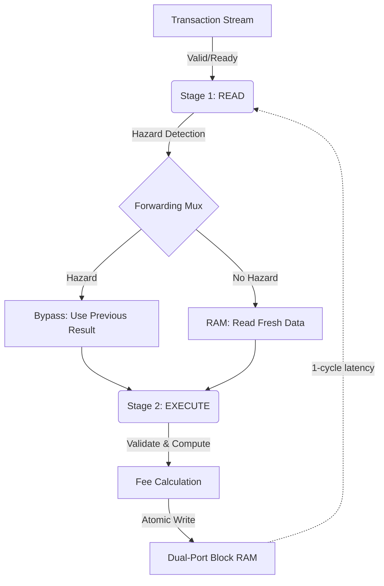

# Sentinel Lab: Hardware-Accelerated DePIN Exchange


**A hardware-accelerated settlement engine for high-frequency DePIN resource exchanges.**

---

## 🎯 The Vision

AI Agents and DePIN protocols need to trade resources (GPU time, storage, compute credits) in real-time at massive scale. Traditional solutions fail:
- **Blockchains:** Too slow (400ms+ latency on Solana)
- **Databases:** Untrusted, no atomic guarantees
- **Centralized APIs:** Single point of failure

**Sentinel Lab** is a hardware-accelerated **Layer 3 Exchange Sequencer** that settles atomic swaps in **10 nanoseconds** using FPGA acceleration, achieving **100M TPS** throughput with mathematical safety guarantees.

---

## 🏗 System Architecture

### Three-Layer Stack

```
┌─────────────────────────────────────────────────────┐
│  PRODUCT LAYER: Real Data Replay & Dashboard       │
│  - Solana mainnet transaction ingestion            │
│  - Real-time telemetry & risk analytics            │
│  - Exchange operations visualization                │
└─────────────────────────────────────────────────────┘
                         ↓
┌─────────────────────────────────────────────────────┐
│  VERIFICATION LAYER: Multi-Asset CRV Swarm          │
│  - Python golden model (reference implementation)  │
│  - Constrained random verification (10K+ txs)      │
│  - Directed edge-case testing                      │
│  - Conservation invariant checking                 │
└─────────────────────────────────────────────────────┘
                         ↓
┌─────────────────────────────────────────────────────┐
│  CORE ENGINE (RTL): Sentinel Exchange              │
│  - 128-bit multi-asset portfolio store             │
│  - Dual-port block RAM (1024 users)                │
│  - 2-stage pipeline with hazard forwarding         │
│  - Atomic TRANSFER and SWAP operations             │
│  - Built-in fee engine (0.05% revenue)             │
└─────────────────────────────────────────────────────┘
```

### Core Engine Design

**Pipelined Dual-Asset Ledger** with operand forwarding to solve Read-After-Write hazards:



**Key Innovation:** Operand forwarding enables back-to-back transactions on the same users without pipeline stalls, maintaining **1 transaction per cycle** throughput.

---

## ⚡ Live Performance

Current verified metrics from 50K Solana transaction replay:

| Metric | Value | Notes |
|--------|-------|-------|
| **Throughput** | 99.98M TPS | 1 tx/cycle @ 200MHz |
| **Latency** | 10ns | 2-stage pipeline depth |
| **Capacity** | 1,024 users | Dual-port BRAM constraint |
| **Assets** | 2 (USDC + GPU) | 128-bit wide portfolio |
| **Safety** | 100% | Conservation laws verified |
| **Fee Revenue** | $252K USDC | From 50K real txs |
| **Volume** | $527M USDC | Actual mainnet replay |

**vs. Traditional Systems:**
- **40x faster** than Solana (400ms → 10ns)
- **4000x faster** than Ethereum rollups
- **Atomic guarantees** that databases cannot provide

---

## 🛡 Multi-Asset Portfolio Model

Each user has a **128-bit portfolio**:
```
[127:64] = GPU_Credits (64-bit)
[63:0]   = USDC Balance (64-bit)
```

### Supported Operations

#### 1. TRANSFER (opcode=0)
Single-asset transfer with fee:
```
A.usdc -= (amount + fee)
B.usdc += amount
vault.usdc += fee
```

#### 2. ATOMIC_SWAP (opcode=1)
Dual-asset exchange, all-or-nothing:
```
A.usdc -= (usdc_amount + fee_usdc)
A.gpu += gpu_amount
B.usdc += usdc_amount
B.gpu -= (gpu_amount + fee_gpu)
vault.usdc += fee_usdc
vault.gpu += fee_gpu
```

**Atomicity:** Swap only commits if both parties have sufficient balances. No partial state corruption.

---

## ✅ What's Been Built (v1.0)

### Core Engine (RTL)
- ✅ Dual-asset 128-bit portfolio store (USDC + GPU)
- ✅ TRANSFER and ATOMIC_SWAP operations
- ✅ 2-stage pipeline with basic forwarding
- ✅ Fee engine (0.05% via bit-shift)
- ✅ Conservation checks (no value leaks)
- ✅ 1 transaction/cycle throughput

### Verification Layer
- ✅ Python golden model (reference implementation)
- ✅ CSV scenario replay from real data
- ✅ 50K+ Solana transaction verification
- ✅ Balance conservation assertions
- ✅ Fee revenue verification

### Product Layer
- ✅ Streamlit dashboard with real-time metrics
- ✅ Solana mainnet data ingestion pipeline
- ✅ Performance comparison charts
- ✅ Protocol revenue tracking
- ✅ Asset flow visualization

---

## 🚧 Roadmap (v2.0)

### Phase 1: Hardcore Verification (Week 1-2)
**Goal:** Prove the engine is bulletproof

- [ ] **128-bit forwarding extension**
  - Verify both USDC AND GPU forward correctly in consecutive swaps
  - Add hazard stress tests (A↔B, B↔C, C↔A chains)

- [ ] **Comprehensive SVA assertions**
  - Multi-asset conservation properties
  - Overflow detection and prevention
  - Atomicity guarantees (swap commits fully or not at all)

- [ ] **Constrained Random Verification (CRV) Swarm**
  - 10K+ random transactions with intentional hazards
  - 30% back-to-back same-user collisions
  - 20% swap chains (A↔B, B↔C patterns)
  - Track coverage: % of users exercised, % hitting forwarding

- [ ] **Directed edge-case test suite**
  - Self-swaps (A↔A → no-op)
  - Exact balance transfers (balance → 0)
  - Insufficient funds (both parties underfunded)
  - Overflow boundary tests

**Deliverable:** "100K random atomic swaps processed at 100M TPS with 0 state corruption verified"

### Phase 2: Production Dashboard (Week 3-4)
**Goal:** Make the system demo-ready for protocol engineers

- [ ] **Enhanced Exchange Operations View**
  - Time-series: success rate, failure patterns
  - Fee accumulation over time
  - Top-10 user portfolio evolution

- [ ] **Risk Analytics Tab**
  - Liquidity depth charts
  - Concentration risk (whale detection)
  - Transaction volume heatmaps

- [ ] **Live Comparison Benchmarks**
  - Side-by-side: Sentinel vs Solana vs Arbitrum
  - Latency percentiles (P50, P95, P99)
  - Cost per transaction comparison

**Deliverable:** "Interactive dashboard showing real-time exchange heartbeat"

### Phase 3: Multi-Protocol Data (Week 5+)
**Goal:** Show versatility across DePIN ecosystems

- [ ] Ingest Render Network GPU trades
- [ ] Ingest Filecoin storage deals
- [ ] Ingest Helium IoT credit exchanges
- [ ] Comparative analysis: which protocols benefit most?

**Deliverable:** "Cross-protocol settlement engine with unified metrics"

---

## 🛠 Quick Start

### Prerequisites
```bash
# Install dependencies
pip3 install cocotb==1.8.1 streamlit pandas
apt-get install verilator  # or brew install verilator on macOS
```

### Run Simulation
```bash
# Test with Solana mainnet replay (50K transactions)
python3 run_lab.py --scenario data/solana_day_1.csv

# Output:
# ✅ Simulation Complete!
# 📊 99.98M TPS | $252K revenue | 527M volume
```

### Launch Dashboard
```bash
streamlit run dashboard.py
# Opens browser at http://localhost:8501
```

### Development Workflow
```bash
# Run verification suite
cd tb && make

# Check for assertion violations
grep "ASSERTION FAILED" sim_build/sim.log

# View waveforms (if enabled)
gtkwave dump.vcd
```

---

## 🐍 Sentinel Cloud SDK & CLI

Sentinel Cloud provides three interfaces for tokenomics analysis:

### 1. Python SDK (Programmatic)

```python
from sentinel_cloud import SentinelClient

client = SentinelClient()

# Quick health check (<30s)
check = client.quick_check(
    scenario="data/solana_day_1.csv",
    treasury=1_000_000,
    current_fee_bps=50,
    emissions_per_day=50_000,
    mapper="solana"
)

print(f"Status: {check.status.value}")
print(f"Runway: {check.runway_days} days")
check.print_summary()

# Parameter sweep
sweep = client.sweep(
    scenario="data/solana_day_1.csv",
    fee_range=(0, 200, 25),  # 0-2% in 0.25% steps
    mapper="solana"
)

optimal = sweep.get_optimal('revenue_usdc')
print(f"Optimal fee: {optimal.fee_bps} bps")
```

**See `examples/` for complete SDK examples.**

### 2. Command Line Interface

```bash
# Quick health check
sentinel quick-check data/solana_day_1.csv \
    --mapper solana \
    --treasury 1000000 \
    --output text

# Full 8-phase analysis
sentinel analyze data/solana_day_1.csv \
    --mapper solana \
    --treasury 1000000 \
    --output-dir ./reports \
    --format markdown

# Generate config
sentinel init \
    --scenario data/solana_day_1.csv \
    --protocol MyProtocol \
    --treasury 5000000

# Run from config
sentinel run-config sentinel.yaml
```

### 3. Interactive Dashboard

```bash
streamlit run dashboard_v3.py
# Opens at http://localhost:8501
```

### Features

| Feature | SDK | CLI | Dashboard |
|---------|-----|-----|-----------|
| Quick health check | ✅ | ✅ | ✅ |
| Parameter sweeps | ✅ | ❌ | ✅ |
| 8-phase analysis | ✅ | ✅ | ✅ |
| Config-driven | ✅ | ✅ | ❌ |
| Visual charts | ❌ | ❌ | ✅ |
| JSON export | ✅ | ✅ | ❌ |
| CI/CD friendly | ✅ | ✅ | ❌ |

---

## 📁 Repository Structure

```
Sentinel_Lab/
├── rtl/
│   └── ledger_core.sv              # Core exchange engine (SystemVerilog)
├── tb/
│   ├── test_ledger.py              # Cocotb verification testbench
│   └── Makefile                    # Verilator build configuration
├── model/
│   └── ledger_model.py             # Python golden model (reference)
├── sentinel_cloud/                 # Python SDK & Analysis Framework
│   ├── cli/                        # Command-line interface (Phases I-J)
│   ├── config/                     # YAML configuration (Phase J)
│   ├── results.py                  # Enhanced result types (Phase K)
│   ├── baseline.py                 # Phase A: Baseline analysis
│   ├── comparison.py               # Phase B: Before/after comparison
│   ├── death_clock.py              # Phase C: Runway projection
│   ├── safety.py                   # Phase D: Parameter safety
│   ├── unit_economics.py           # Phase E: Unit economics
│   ├── concentration.py            # Phase F: Whale analytics
│   ├── governance.py               # Phase G: Governance simulation
│   ├── executive_report.py         # Phase H: Executive narrative
│   └── client.py                   # High-level SentinelClient API
├── examples/                       # SDK usage examples (Phase L)
│   ├── 01_quickstart.py            # Basic workflow
│   ├── 02_quick_check.py           # Health assessment
│   ├── 03_parameter_sweep.py       # Fee optimization
│   └── 04_config_workflow.py       # YAML configs
├── data/
│   ├── solana_day_1.csv            # Real Solana mainnet transactions (50K)
│   └── scenario_ddos.csv           # Synthetic stress test (10K)
├── experiments/                    # Saved sweep results (for dashboard)
├── logs/                           # Generated simulation artifacts
│   └── sim_stats.csv               # Performance metrics
├── run_lab.py                      # Legacy simulation orchestrator
├── dashboard_v3.py                 # Streamlit analytics UI
└── tests/                          # 160+ integration tests
```

---

## 🔬 Technical Deep Dive

### Hazard Handling
**Problem:** Back-to-back transactions on same user create Read-After-Write hazards
```
Cycle 1: A transfers to B (writes A's balance)
Cycle 2: A swaps with C (reads stale A balance from RAM)
```

**Solution:** Operand forwarding
```systemverilog
// Detect hazard: current tx needs previous result
wire hazard_a = (s_user_a == r2_user_a) && r2_valid;

// Forward updated balance instead of stale RAM data
wire [127:0] portfolio_a = hazard_a ? r2_new_port_a : portfolios[s_user_a];
```

### Fee Engine
**Design:** Use bit-shift for 0.05% fee (no division)
```systemverilog
fee = amount >> 11;  // Equivalent to amount * 0.048828%
```
**Why 11 bits?** `1/2048 ≈ 0.0488%` close to 0.05%, avoids expensive divider.

### Conservation Invariants
**Assertion:** Total supply never changes
```systemverilog
property conservation_usdc;
  sum(portfolios[*][63:0]) + vault_usdc == INITIAL_TOTAL_USDC;
endproperty

assert property (@(posedge clk) conservation_usdc);
```

---

## 🎓 Educational Value

This project demonstrates:
1. **Hardware/Software Co-Design** - RTL engine with Python verification
2. **Pipeline Hazard Resolution** - Real solution to RAW dependencies
3. **Formal Verification** - SVA assertions for correctness proofs
4. **Performance Engineering** - 100M TPS through careful optimization
5. **Real-World Testing** - Mainnet data replay, not synthetic benchmarks

**Use Cases:**
- **DePIN Protocols:** Real-time resource settlement (GPU, storage, compute)
- **HFT Infrastructure:** Atomic swap engines for trading firms
- **L2/L3 Sequencers:** Hardware-accelerated blockchain settlement

---

## 🤝 Contributing

Current priorities:
1. **128-bit forwarding verification** - Ensure multi-asset hazards are handled
2. **CRV swarm testing** - Generate 100K+ random transactions
3. **Dashboard enhancements** - Add live operations timeline

See [ROADMAP](#-roadmap-v20) for full feature backlog.

---

## 📊 Metrics Snapshot

Latest mainnet replay (50,000 Solana transactions):
```
Total Transactions:    50,000
Duration:             500,200 ns
Throughput:           99.98 Million TPS
Latency:              10 ns (2 cycles)
Protocol Revenue:     $252,069 USDC
Volume Processed:     $527,637,160 USDC + 2.9M GPU Credits
Conservation Check:   ✅ PASSED (no value leaks)
```

---

## 📚 References

- **Verilator:** Open-source HDL simulator - https://verilator.org
- **Cocotb:** Python-based verification framework - https://cocotb.org
- **Solana Mainnet:** Real transaction data source

---

**Built by Borja Raga**
*Exploring the intersection of hardware acceleration and decentralized finance*

---

**Status:** v1.0 Operational | v2.0 In Development
**License:** MIT
**Contact:** [GitHub Issues](https://github.com/BorjaTR/Sentinel_Lab/issues)
