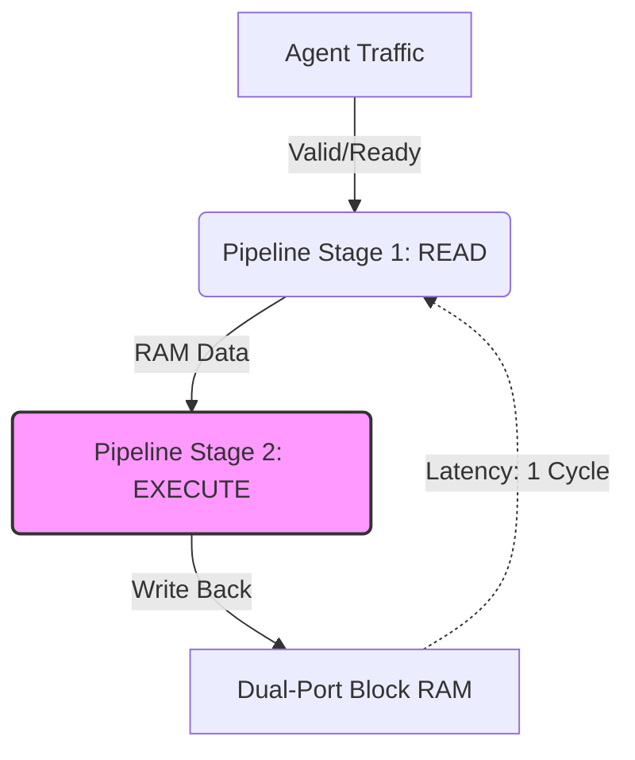

# Sentinel Lab: Agentic Settlement Risk Simulator

**A hardware-accelerated "Physics Engine" for simulating high-frequency AI Agent economies.**

## 🚀 The Goal
As AI Agents begin trading resources (GPU time, API credits) autonomously, they need a settlement layer that handles **Read-After-Write (RAW) hazards** at line rate. 

**Sentinel Lab** is a portfolio project building this infrastructure from the transistor up. It simulates a high-frequency ledger that allows agents to transact in nanoseconds, identifying where standard architectures fail under load.

## 🏗 Architecture (Day 1)
We are building a **Pipelined Dual-Port Ledger**.

Capacity: 1,024 Agents.

Precision: 64-bit Balances.

Throughput: 1 Transaction / Cycle.

# 🔬 Phase 1: The "Double Spend" Hazard
The current implementation (ledger_core.sv) uses a standard 2-stage pipeline. Through rigorous verification (test_ledger.py), we have demonstrated a critical Read-After-Write (RAW) hazard.

The Scenario:

Agent 1 sends money to Agent 3 (Cycle N).

Agent 1 sends money to Agent 4 (Cycle N+1).

The Failure: Because the memory write from Transaction A hasn't finished before Transaction B reads, Transaction B sees stale data.

# 🚨 Verification Evidence (Day 1 Log)

Plaintext
--- SCENARIO 2: The RAW Hazard (Back-to-Back) ---
Final Hardware Balance for Agent 1: 940
Expected Model Balance for Agent 1: 930
HAZARD DETECTED! 🚨 The second transaction read stale data!
AssertionError: RAW Hazard Bug Found! (This is intentional for Day 1)

# 🗓 Roadmap
Day 1: Naive Core & Bug Reproduction (Done ✅)

Day 2: Hazard Resolution (Forwarding/Bypass Logic)

Day 3: Invariant Checking (SystemVerilog Assertions)

Day 4: Python API & Traffic Generator

Day 5: Risk Dashboard (Streamlit)

# 🛠 Run the simulation
cd tb
make

Built by Borja Raga