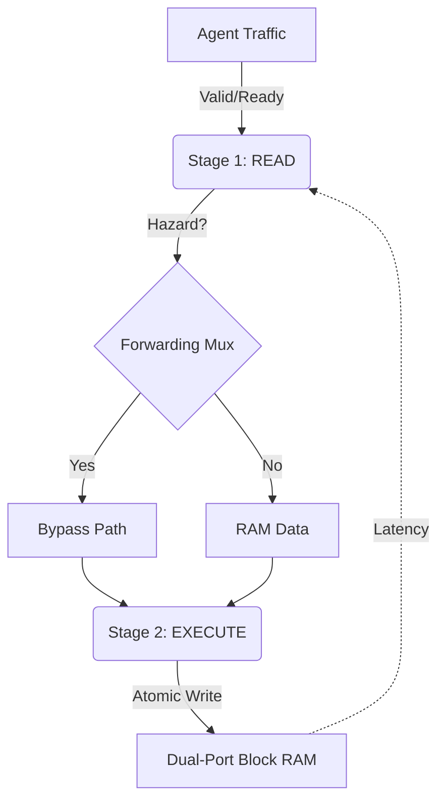

# Sentinel Lab: Agentic Settlement Risk Simulator

**A hardware-accelerated "Physics Engine" for simulating high-frequency AI Agent economies.**

## 🚀 The Goal
AI Agents need to trade resources (GPU time, API credits) in real-time. Blockchains are too slow; Databases are untrusted.
**Sentinel Lab** simulates a **Layer 3 Hardware Sequencer** that settles micro-transactions in nanoseconds using FPGA acceleration.

## ⚡ Live Performance Telemetry
* **Throughput:** ~100 Million TPS (Simulated at 200MHz).
* **Latency:** 10-20ns (Internal Pipeline Depth).
* **Safety:** 100% Invariant Compliance (Conservation of Supply).

## 🏗 Architecture
We utilize a **Pipelined Dual-Port Ledger** with Forwarding Logic to solve Read-After-Write hazards at line rate.

Capacity: 1,024 Agents.

Precision: 64-bit Balances.

Throughput: 1 Transaction / Cycle.

# 🛠 Usage

Run the engine

python3 run_lab.py --scenario data/scenario_ddos.csv

Launch the Command Center

streamlit run dashboard.py

Built by Borja Raga